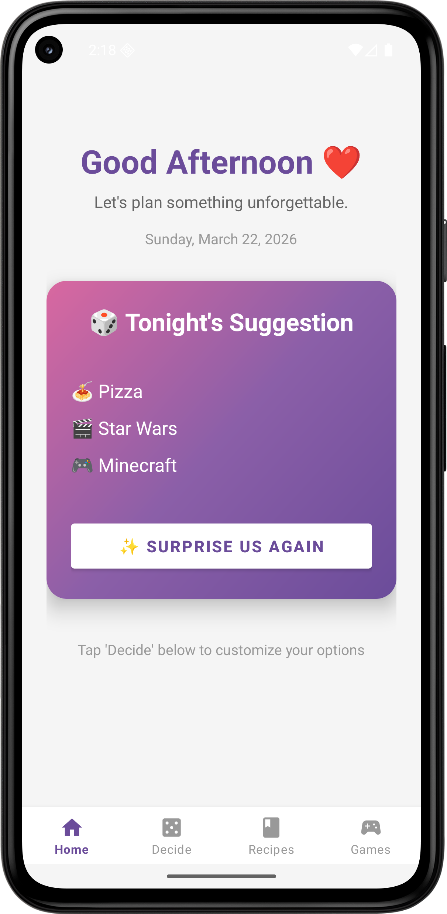
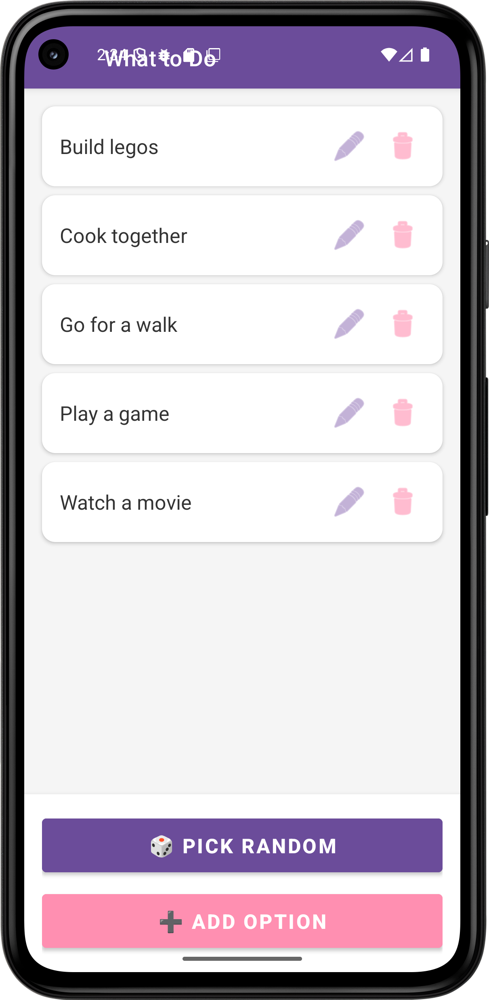

# Date Night App 💕


A simple Android app to help you and your girlfriend decide what to do or eat on date nights!

## Features

- 🎭 **What to Do** - Manage a list of date activities
- 🍕 **What to Eat** - Manage a list of food options
- 🎬 **What to Watch** - Manage a list of movie/show options
- 🎮 **Game Night** - Manage a list of game options
- 🎲 **Random Picker** - Can't decide? Let the app pick for you!
- ➕ **Add Options** - Add new activities or food choices
- ✏️ **Edit Options** - Update existing options
- 🗑️ **Delete Options** - Remove options you don't want anymore
- 💾 **Persistent Storage** - All data saved in SQLite database

## Screenshots




## Technologies Used

- **Language:** Java
- **Database:** SQLite
- **UI Components:** RecyclerView, CardView, Material Design
- **Architecture:** MVC Pattern

## How to Run

1. Clone this repository
```bash
   git clone https://github.com/yourusername/DateNightApp.git
```
2. Open in Android Studio
3. Run on emulator or physical device (API 24+)

## How to Use
1. **Home Screen:** Choose between "What to Do" or "What to Eat"
2. **Options Screen:**
   - View all your saved options
   - Tap "🎲 Pick Random" to randomly select an option
   - Tap "➕ Add Option" to add a new choice
   - Use the edit ✏️ icon to modify an option
   - Use the delete 🗑️ icon to remove an option\

## Troubleshooting
**App won't run?**
- Make sure your build.gradle dependencies match the versions I provided
- Check that your minSdk is at least API 24
- Try "Build → Clean Project" then "Build → Rebuild Project"

**Can't see the layout files?**
- Make sure you're viewing the "Android" project structure (dropdown at top left)
- Check that files are in the correct directories

**Database issues?**
- Uninstall the app from your device/emulator and reinstall
- This will create a fresh database

## Author

Created with love for date nights

## Show Your Support

Give a ⭐️ if this project helped you!

---

**Happy Date Nights! 💑**
