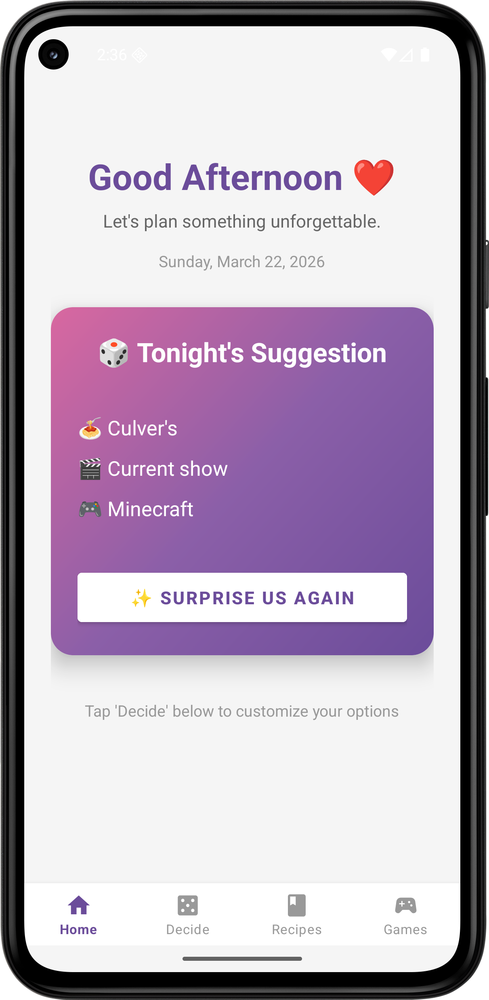
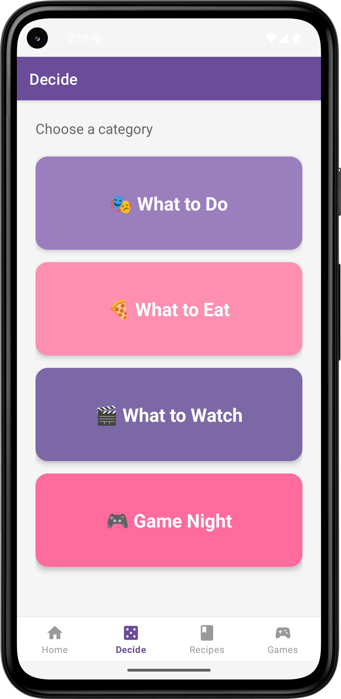
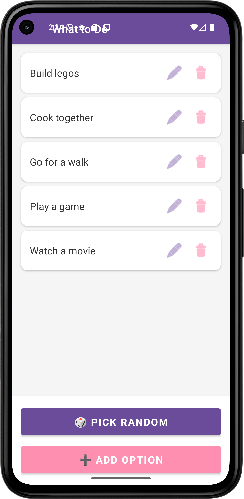
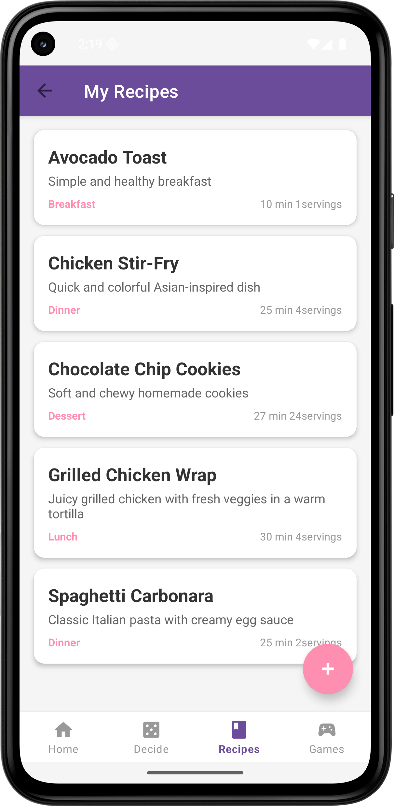
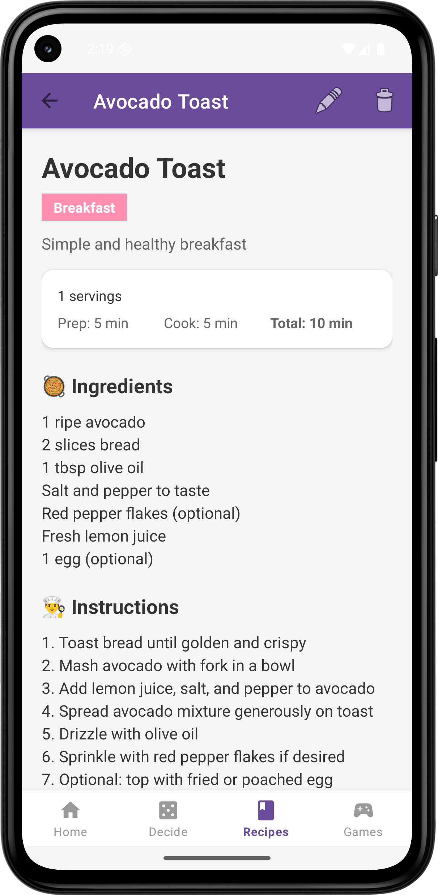
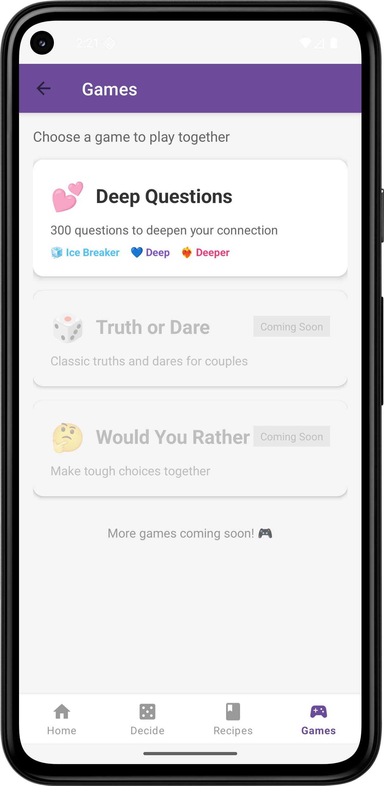
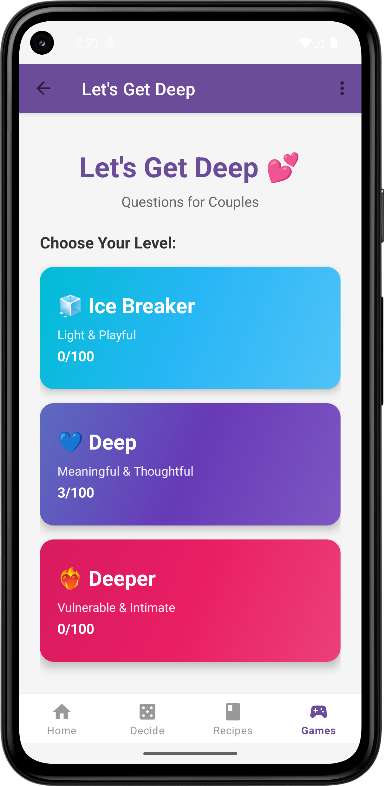

# Date Night App 💕


A simple Android app to help you and your girlfriend decide what to do or eat on date nights!

## Features

### Home Screen
- **Time-based greeting** - Good Morning/Afternoon/Evening/Night
- **Tonight's Suggestion** - Random picks from your saved options
- **Quick navigation** - Easy access to all sections

### Category Management
- **What to Do** - Manage a list of date activities
- **What to Eat** - Manage a list of food options
- **What to Watch** - Manage a list of movie/show options
- **Game Night** - Manage a list of game options
- **Random Picker** - Can't decide? Let the app pick for you!
- **Add/Edit/Delete** - Full CRUD operations for all options
- **Persistent Storage** - All data saved in SQLite database

### Recipe Organizer
- **Browse recipes** - View your entire recipe collection
- **Recipe categories** - Breakfast, Lunch, Dinner, Dessert, Snack
- **Detailed view** - See ingredients, instructions, prep/cook times, and chef's notes
- **Add custom recipes** - Create your own recipes with full details
- **Edit recipes** - Update any recipe at any time
- **Delete recipes** - Remove recipes you no longer need
- **5 default recipes** - Pre-loaded to get you started
- **Separate database** - Dedicated Recipes.db for organization

### Deep Questions Game
- **300 thought-provoking questions** for couples across 3 levels:
  - **Ice Breaker** (100 questions) - Light & playful
  - **Deep** (100 questions) - Meaningful & thoughtful
  - **Deeper** (100 questions) - Vulnerable & intimate
- **Progress tracking** - See how many questions you've discussed per level
- **Favorites** - Star and save your favorite questions
- **View favorites** - Access all your starred questions in one place
- **Reset progress** - Start over for any level or reset all progress
- **Resume where you left off** - Automatically continues from your last question

### UI/UX Features
- **Dark Mode** - Full dark theme support for all screens
- **Bottom Navigation** - Seamless navigation between all sections
- **Beautiful gradients** - Eye-catching color schemes for each level
- **Progress indicators** - Visual feedback on question completion
- **Interactive elements** - Smooth animations and transitions

## Screenshots









## Technologies Used

- **Language:** Java
- **Database:** SQLite
- **UI Components:** RecyclerView, CardView, Material Design, Bottom Navigation
- **Architecture:** MVC Pattern

## How to Run

1. Clone this repository
```bash
   git clone https://github.com/altoro-dev/DateNightApp.git
```
2. **Open in Android Studio**
   - File → Open → Select the DateNightApp folder

3. **Build the project**
   - Build → Clean Project
   - Build → Rebuild Project

4. **Run on device**
   - Connect Android device or start emulator
   - Click Run (Green play button)
   - Requires API 24+ (Android 7.0+)

## How to Use
### Main Navigation
- **Home Tab** - See tonight's suggestions and quick access
- **Decide Tab** - Choose from 4 categories (Activities, Food, Watch, Games)
- **Recipes Tab** - Browse and manage your recipe collection
- **Games Tab** - Access Deep Questions and future games

### Managing Options
1. **View options** - Tap any category to see your saved choices
2. **Add option** - Tap the ➕ button and fill in details
3. **Edit option** - Tap the ✏️ icon next to any option
4. **Delete option** - Tap the 🗑️ icon to remove
5. **Pick random** - Tap 🎲 to let the app decide!

### Recipe Features
1. **Browse recipes** - Tap Recipes tab to see your collection
2. **View details** - Tap any recipe card to see full details
3. **Add recipe** - Tap the ➕ floating button
4. **Edit recipe** - Open recipe details → Tap edit icon
5. **Delete recipe** - Open recipe details → Tap delete icon → Confirm

### Deep Questions
1. **Select level** - Tap Games → Deep Questions → Choose your level
2. **Discuss questions** - Read each question together
3. **Save favorites** - Tap the ⭐ star to save meaningful questions
4. **Next question** - Tap "Next Question →" to continue
5. **View favorites** - Tap "⭐ View Favorites" from main screen
6. **Reset progress** - Menu (⋮) → Reset Progress → Choose level or all

## Troubleshooting
**App won't run?**
- Make sure your build.gradle dependencies match the versions I provided
- Check that your minSdk is at least API 24
- Try "Build → Clean Project" then "Build → Rebuild Project"

**Can't see the layout files?**
- Make sure you're viewing the "Android" project structure (dropdown at top left)
- Check that files are in the correct directories

**Database issues?**
- Uninstall the app from your device/emulator and reinstall
- This will create a fresh database

## Author

Created with love for date nights

## Show Your Support

Give a ⭐️ if this project helped you!

---

**Happy Date Nights! 💑**
